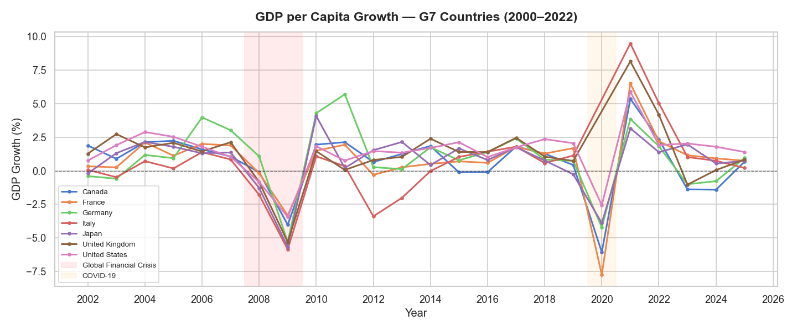
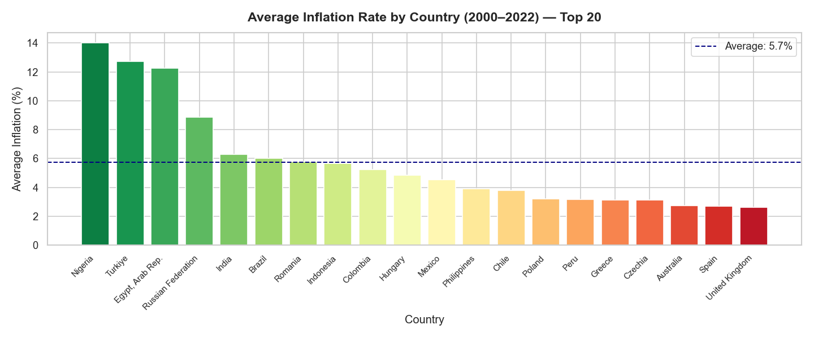
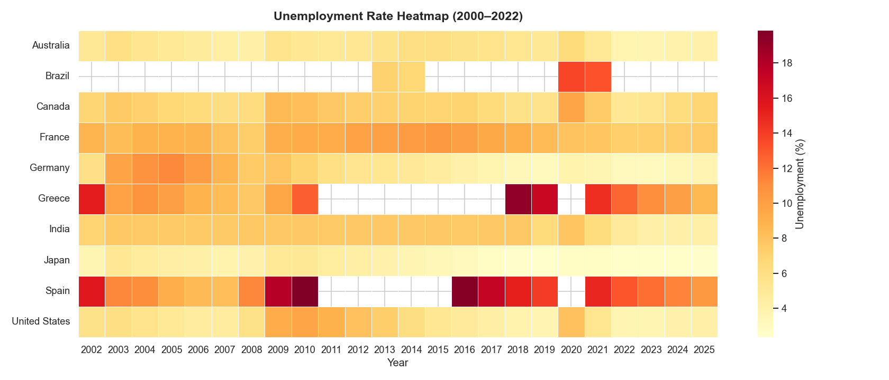
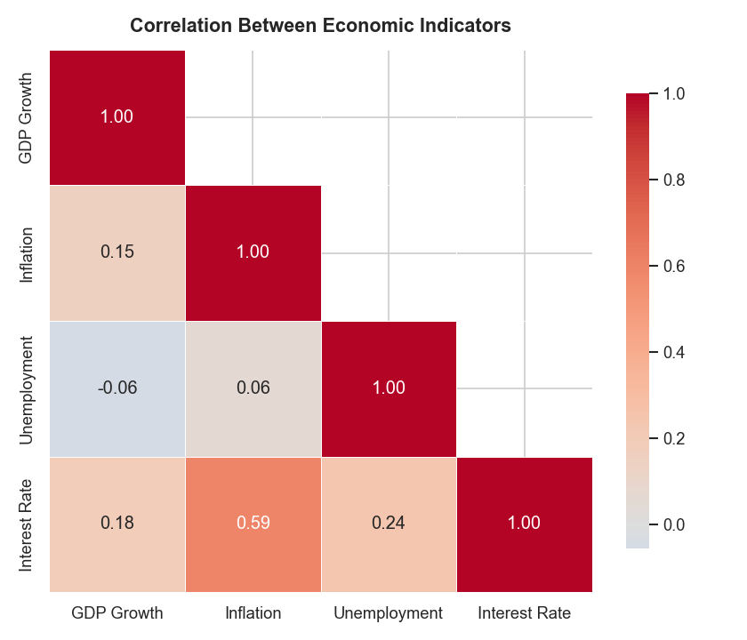
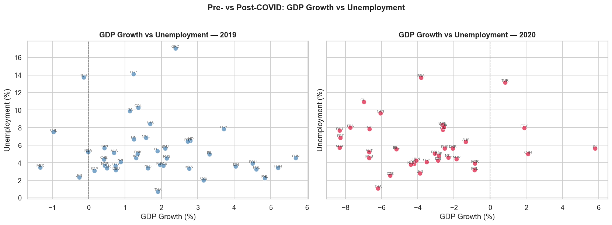
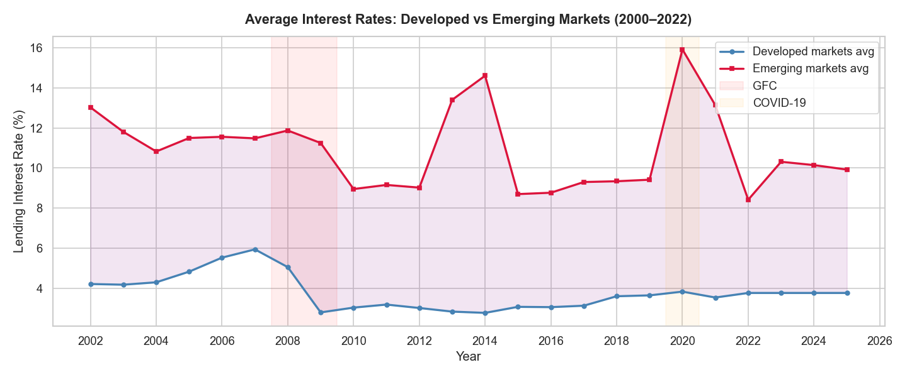
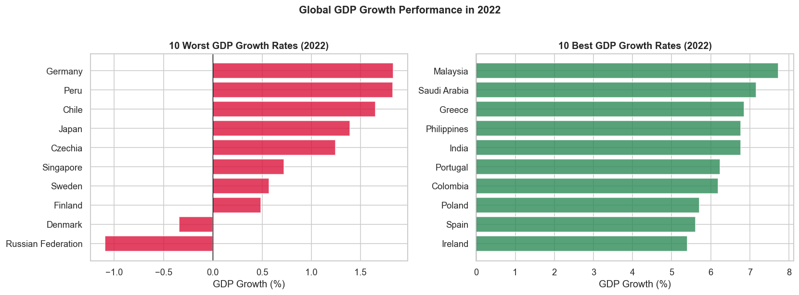
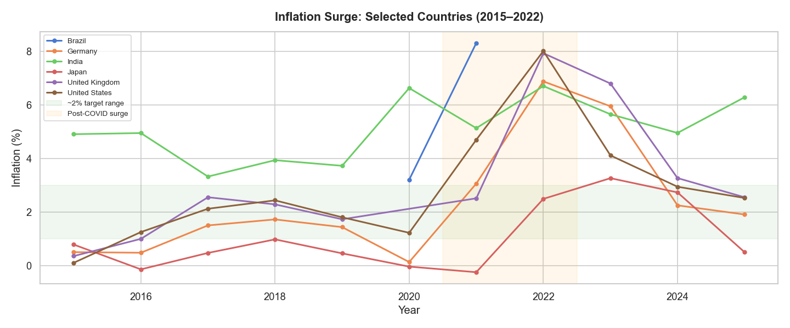

# 🌍 World Economic Indicators — Exploratory Data Analysis


## Overview
An exploratory data analysis of macroeconomic trends across **45 countries from 2000 to 2022**,
using data sourced directly from the **World Bank Open Data API**.

This project examines GDP growth, inflation, unemployment, and interest rates to uncover
global patterns, the impact of major economic crises, and structural differences between
developed and emerging economies.

> Built as part of my transition from Financial Data Analysis into Data Science,
> combining my Economics background with Python-based data analysis.

---

## Questions Explored
1. How did the 2008 Global Financial Crisis and COVID-19 affect GDP across G7 economies?
2. Which countries have chronically high inflation, and why?
3. What does unemployment look like across countries over time — and where did it spike?
4. How correlated are GDP growth, inflation, unemployment, and interest rates?
5. How different are interest rate levels between developed and emerging markets?
6. Which economies grew fastest and slowest in 2022?
7. How severe and widespread was the 2021–2022 inflation surge?

---

## Key Findings
- The 2008 crisis and COVID-19 caused **synchronized GDP contractions** across all G7 economies,
  with Italy and the UK showing the slowest post-crisis recovery
- **Greece and Spain** maintained unemployment above 20% for most of the 2010s — a direct
  result of Eurozone austerity measures
- **GDP growth and unemployment are negatively correlated**, consistent with Okun's Law
- Emerging markets carry **persistently higher interest rates** than developed ones —
  on average 8–10 percentage points higher — reflecting currency risk and inflation expectations
- The **2021–2022 inflation surge** was nearly universal, but Turkey was an extreme outlier,
  driven by unconventional monetary policy

---

## Charts

### GDP Growth — G7 Countries (2000–2022)


### Average Inflation by Country


### Unemployment Heatmap


### Correlation Between Indicators


### GDP vs Unemployment: Pre- vs Post-COVID


### Interest Rates: Developed vs Emerging Markets


### GDP Growth: Best vs Worst Performers (2022)


### Inflation Surge (2015–2022)


---

## Dataset
| Property | Detail |
|----------|--------|
| Source | World Bank Open Data API |
| Coverage | 45 countries, 2000–2022 |
| Indicators | GDP per capita growth (%), Inflation CPI (%), Unemployment rate (%), Lending interest rate (%) |
| Access | Free, no login required |
| Retrieved via | Python `requests` library |

---

## Tools & Libraries
| Tool | Purpose |
|------|---------|
| Python 3.14 | Core language |
| pandas | Data loading, cleaning, transformation |
| matplotlib | Base visualizations |
| seaborn | Statistical plots and heatmaps |
| numpy | Numerical operations |
| requests | API data retrieval |
| Jupyter Notebook | Interactive analysis environment |

---

## Project Structure
world-economic-indicators-eda/
│
├── data/
│   └── macro_indicators.csv     # Downloaded World Bank data
│
├── charts/                      # All 8 exported charts (.png)
│   ├── 01_gdp_growth_g7.png
│   ├── 02_avg_inflation_by_country.png
│   ├── 03_unemployment_heatmap.png
│   ├── 04_correlation_matrix.png
│   ├── 05_gdp_vs_unemployment_covid.png
│   ├── 06_interest_rates_dev_vs_emerging.png
│   ├── 07_gdp_top_bottom_2022.png
│   └── 08_inflation_surge.png
│
├── download_data.py             # Script to fetch data from World Bank API
├── analysis.ipynb               # Main Jupyter notebook with full analysis
└── README.md                    # This file
---

## How to Reproduce
```bash
# 1. Clone the repository
git clone https://github.com/nestorasnq/world-economic-indicators-eda

# 2. Install dependencies
pip install pandas matplotlib seaborn jupyter requests numpy

# 3. Download the data
python download_data.py

# 4. Open the notebook
jupyter notebook analysis.ipynb
```

---

## Author
**Dimitris Nestoras** — Economics graduate transitioning into Data Science.
Currently working as a Financial Data Analyst as of May 2026.

[](https://www.linkedin.com/in/dimitris-nestoras-86643b290/)
[](https://github.com/nestorasnq)